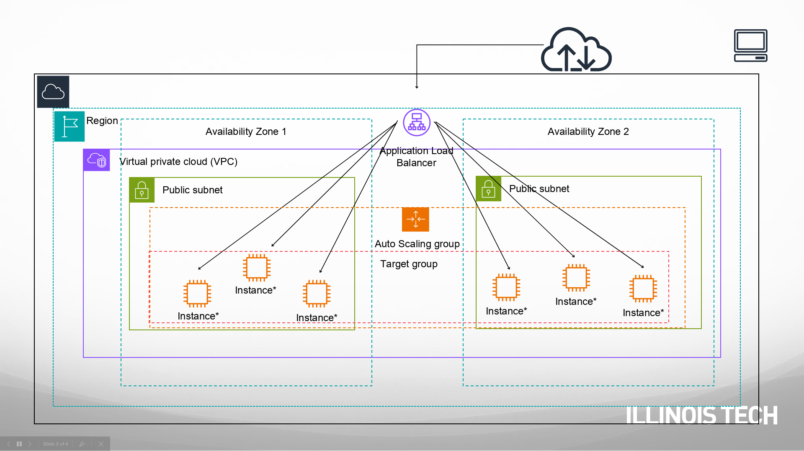

# Cloud-Computing-Illinois-Tech Assignments
Assignment Repository for Coursera's Cloud Computing by Illinois Tech.

## Architecture
1. For **Autoscaling** of **EC2 Instances** using *Auto Scaling Group*, *Application ELB*, and *Target Group:*


## Requirements
We need to install some packages into Vagrant box:
```bash
sudo apt update
sudo apt install python3-dev python3-setuptools python3-pip python3-venv
```

Then to install required python packages:
```python
python3 -m venv .venv
source .venv/bin/activate
python3 -m pip install -r ./requirements.txt
```
To pass the positional arguments to the bash scripts, create a arguments.txt in root dir.
```bash
sudo vim arguments.txt
```
Then add (replace) the respective values:
```vim
image-id
instance-type
key-name
security-group-ids
count - of 3
user-data -- use install-env.sh
Tag
Target Group
elb-name
Availability Zone 1
Availability Zone 2
Launch Template Name
ASG name
ASG min=2
ASG max=5
ASG desired=3
AWS Region for LaunchTemplate (use your default region)
EBS hard drive size in GB (15)
S3 bucket name one
S3 bucket name two
Secret Name
Database Name
```

To use **Terraform** as *Infrastructure as Code*, we install the package into the Vagrant VM. The instructions can be found [here](https://developer.hashicorp.com/terraform>.

We need a *.tfvars* file to pass the AWS configuration variables to *varaibles.tf*. To create that, we use:
```bash
cat << EOF > terraform.tfvars
imageid                = ""
instance-type          = ""
key-name               = ""
vpc_security_group_ids = ""
cnt                    =
install-env-file       = ""
elb-name               = ""
tg-name                = ""
asg-name               = ""
lt-name                = ""
module-tag             = ""
EOF
```